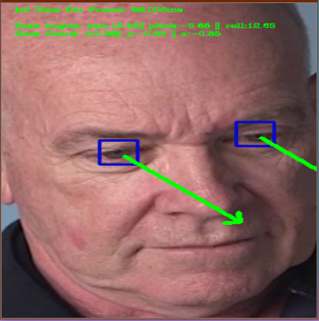

# Computer Pointer Controller

Computer Pointer Controller is a project based on the Openvino DL framework that utilizes multiple models to control a mouse pointer using your eyes. This project utilizes various models like Face Detection, Facial Landmark Detection, Head Post Estimation, and also finally the Gaze Estimation from previous model outputs.  

## Project Set Up and Installation

### File Structure
1. inference classes
    . face_detection.py
    . facial_landmarks_detection.py
    . gaze_estimation.py
    . head_pose_estimation.py
2. input_feeder.py
3. main.py
4. mouse_controller.py
5. requirements.txt

### Prerequisite
1. Openvino Toolkit
2. pip
3. python3
    . virtualenv 

### Models used

1. face-detection-adas-binary-0001
```
cd <openvinodir>/deployment_tools/open_model_zoo/tools/downloader
python3 donwnloader.py --name face-detection-adas-binary-0001 -o ./src/models
```

2. head-pose-estimation-adas-0001
```
cd <openvinodir>/deployment_tools/open_model_zoo/tools/downloader
python3 donwnloader.py --name head-pose-estimation-adas-0001 -o ./src/models
```

3. landmarks-regression-retail-0009
```
cd <openvinodir>/deployment_tools/open_model_zoo/tools/downloader
python3 donwnloader.py --name landmarks-regression-retail-0009 -o ./src/models
```

4. gaze-estimation-adas-0002
```
cd <openvinodir>/deployment_tools/open_model_zoo/tools/downloader
python3 donwnloader.py --name gaze-estimation-adas-0002 -o ./s/models`
```

### Installation

1. Setup the virtual environment
```
python3 -m venv env
source env/bin/activate
```
2. Install python dependencies
`pip3 install -r requirements.txt`

## Demo

```
python src\main.py -fd_m "src\models\face-detection-adas-binary-0001\FP32\face-detection-adas-binary-0001.xml" -hp_m "src\models\head-pose-estimation-adas-0001\FP16\head-pose-estimation-adas-0001.xml" -fld_m "src\models\landmarks-regression-retail-0009\FP16\landmarks-regression-retail-0009.xml" -ge_m "src\models\gaze-estimation-adas-0002\FP16\gaze-estimation-adas-0002.xml" -i "bin\demo.mp4" --type video -flags fl hp ge
```


## Documentation

### Command Line Arguments
```
usage: main.py [-h] -fd_m FACE_DETECTOR_MODEL -hp_m HEAD_POSE_ESTIMATION_MODEL
               -fld_m FACIAL_LANDMARK_MODEL -ge_m GAZE_ESTIMATION_MODEL -i    
               INPUT [-mc_prec MOUSE_PREC] [-mc_speed MOUSE_SPEED]
               [-type TYPE] [-l CPU_EXTENSION] [-d DEVICE]
               [-flags PREVIEW_FLAGS [PREVIEW_FLAGS ...]] [-pt PROB_THRESHOLD]

optional arguments:
  -h, --help            show this help message and exit
  -fd_m FACE_DETECTOR_MODEL, --face_detector_model FACE_DETECTOR_MODEL        
                        Path to a face detection xml file with a trained      
                        model.
  -hp_m HEAD_POSE_ESTIMATION_MODEL, --head_pose_estimation_model HEAD_POSE_ESTIMATION_MODEL
                        Path to a head pose estimation xml file with a trained
                        model.
  -fld_m FACIAL_LANDMARK_MODEL, --facial_landmark_model FACIAL_LANDMARK_MODEL
                        Path to a facial landmark detection xml file with a
                        trained model.
  -ge_m GAZE_ESTIMATION_MODEL, --gaze_estimation_model GAZE_ESTIMATION_MODEL
                        Path to a gaze estimation xml file with a trained
                        model.
  -i INPUT, --input INPUT
                        Path to image or video file
  -mc_prec MOUSE_PREC, --mouse_prec MOUSE_PREC
                        mouse precision needed values are high-low-medium
  -mc_speed MOUSE_SPEED, --mouse_speed MOUSE_SPEED
                        mouse speed needed values are fast-slow-medium
  -type TYPE, --type TYPE
                        single image mode yes/no
  -l CPU_EXTENSION, --cpu_extension CPU_EXTENSION
                        MKLDNN (CPU)-targeted custom layers.Absolute path to a
                        shared library with thekernels impl.
  -d DEVICE, --device DEVICE
                        Specify the target device to infer on: CPU, GPU, FPGA
                        or MYRIAD is acceptable. Sample will look for a
                        suitable plugin for device specified (CPU by default)
  -flags PREVIEW_FLAGS [PREVIEW_FLAGS ...], --preview_flags PREVIEW_FLAGS [PREVIEW_FLAGS ...]
                        flags to set intermediate flags. fl: facial landmark
                        || hp: head pose || ge: gaze estimation
  -pt PROB_THRESHOLD, --prob_threshold PROB_THRESHOLD
                        Probability threshold for detections filtering(0.5 by
                        default)
```


## Benchmarks

CPU: i5 - 4210U@1.70GHz 2.40 GHz

| Models                          | Precision | Size   | Model Loading | FPS         |
|---------------------------------|-----------|--------|---------------|-------------|
| face-detection-adas-binary-0001 | FP32      | 1.8Mb  |               |             |
| facial-landmarks-35-adas-0002   | INT8      | 260Kb  | 900ms         | 38FPS~40FPS |
| head-pose-estimation-adas-0001  | INT8      | 2.01Mb |               |             |
| gaze-estimation-adas-0002       | INT8      | 2.0Mb  |               |             |


| Models                          | Precision | Size   | Model Loading | FPS   |
|---------------------------------|-----------|--------|---------------|-------|
| face-detection-adas-binary-0001 | FP32      | 1.8Mb  |               |       |
| facial-landmarks-35-adas-0002   | FP16      | 388Kb  | 1000ms        | 32FPS |
| head-pose-estimation-adas-0001  | FP16      | 3.69Mb |               |       |
| gaze-estimation-adas-0002       | FP16      | 3.65Mb |               |       |


| Models                          | Precision | Size   | Model Loading | FPS   |
|---------------------------------|-----------|--------|---------------|-------|
| face-detection-adas-binary-0001 | FP32      | 1.8Mb  |               |       |
| facial-landmarks-35-adas-0002   | FP32      | 760Kb  | 1200ms        | 28FPS |
| head-pose-estimation-adas-0001  | FP32      | 7.31Mb |               |       |
| gaze-estimation-adas-0002       | FP32      | 7.2Mb  |               |       |

## Output



## Results

From the benchmark, we could see that INT8 has a better FPS compared to others but its accuracy and performance were very poor. FPS32 was having a very large margin in model size compared to others. From the benchmark, I chose FP16 generally with Face Detector having FP32. But my processor is really old compared to openvino's prerequisite. A better latest hardware could have improved model loading and FPS by a large margin.

### Edge Cases

1. Mouse may endup going furthur than screen and gets into error
    Solved this by checking the movement of the mouse and bounding it to screen size.

2. Face may not be detected and may fire error
    Here i have skipped the inference on face missing cases
